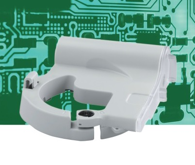
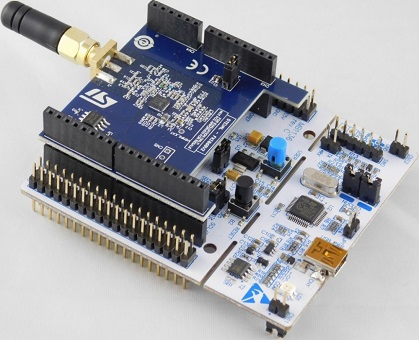

# IZAR I R4 PRIOS meter collector

 

## Introduction

This project contains the implementation of a Wireless M-Bus (WMBus) collector for DIEHL IZAR I R4 smart meters, running
on a ST-Micro [STEVAL-FKI868V2](https://www.st.com/en/evaluation-tools/steval-fki868v2.html) kit (a [NUCLEO-L053R8](https://www.st.com/content/st_com/en/products/evaluation-tools/product-evaluation-tools/mcu-mpu-eval-tools/stm32-mcu-mpu-eval-tools/stm32-nucleo-boards/nucleo-l053r8.html) board with a [S2-LP](https://www.st.com/content/st_com/en/products/wireless-transceivers-mcus-and-modules/sub-1ghz-rf/s2-lp.html) 868MHz transceiver).

### Supported smart meters

- DIEHL Metering (ex SAPPEL) IZAR 868 I R4 LIGHT

Many more devices should be supported (probably most if not all DIEHL PRIOS smart water meters).

Please report yours if you tested them.

## Usage

### General

Build the application using your favorite IDE (an IAR/EWARM workspace is provided).

Flash the firmware into the Cortex M0 microcontroller.

Plug the board into a computer using a USB connector.

Open the USB virtual COM port provided by the board, with speed 115200.

The device outputs every smart meter readings in real time:
    
    # socat open:/dev/cuaU0,raw,echo=0,ispeed=115200,ospeed=115200 -
    20d51a73,100750,99935
    20d52c1a,330604,329942
    20d53a72,65299,64680
    20d54c16,92546,92277
    20d55c1e,102543,101646
    20d56c1d,91966,90586
    20d577ca,80416,77826

The format is: `[device identifier],[current_reading],[last_month_reading]`, with both readings in cubic meters (m3).

### Shell

Logging the values for a specific meter in a file, prepending each line with the current timestamp can be done with some
shell scripting:

    socat open:/dev/cuaU0,raw,echo=0,ispeed=115200,ospeed=115200 - | grep 20d78c1e | awk '{cmd="date +%s"; (cmd | getline date); close(cmd); print date "," $1}' >> /var/log/izar_local.log

### Python

Reading the values in Python is trivial as well:

```
import serial
with serial.Serial('/dev/cuaU0', 115200, timeout=60) as ser:
    while True:
       line = ser.readline()
       if not line:
           continue
       data = line.split(',')
       print('Meter {}: current={}m3, last_month={}m3'.format(data[0], float(data[1]) / 1000, float(data[2]) / 1000))
```

```
Meter 20d51c16: current=92.546m3, last_month=92.277m3
Meter 20d52c1d: current=91.966m3, last_month=90.586m3
Meter 20d53c1e: current=102.543m3, last_month=101.646m3
Meter 20d547c6: current=77.408m3, last_month=76.001m3
Meter 20d55a73: current=100.75m3, last_month=99.935m3
Meter 20d56c1c: current=301.664m3, last_month=300.839m3
```

## Authors

Erwan Martin <public@fzwte.net>

The logic to decrypt and decode the PRIOS protocol is originally from Jacek Tomasiak.

## Licence

The application code is protected by licence [BSD-3-Clause](https://opensource.org/licenses/BSD-3-Clause).

The project uses C libraries provided by STMicroelectronics, which are protected by their own licences. 
